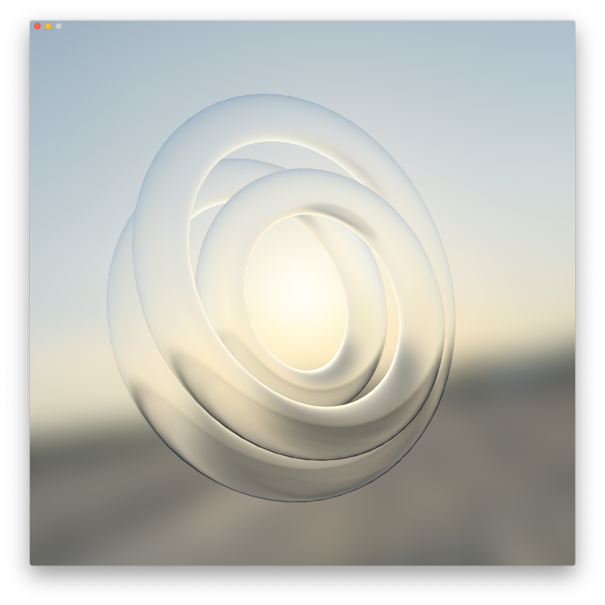
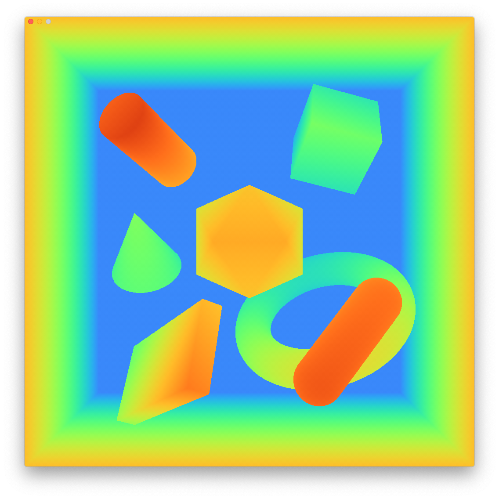
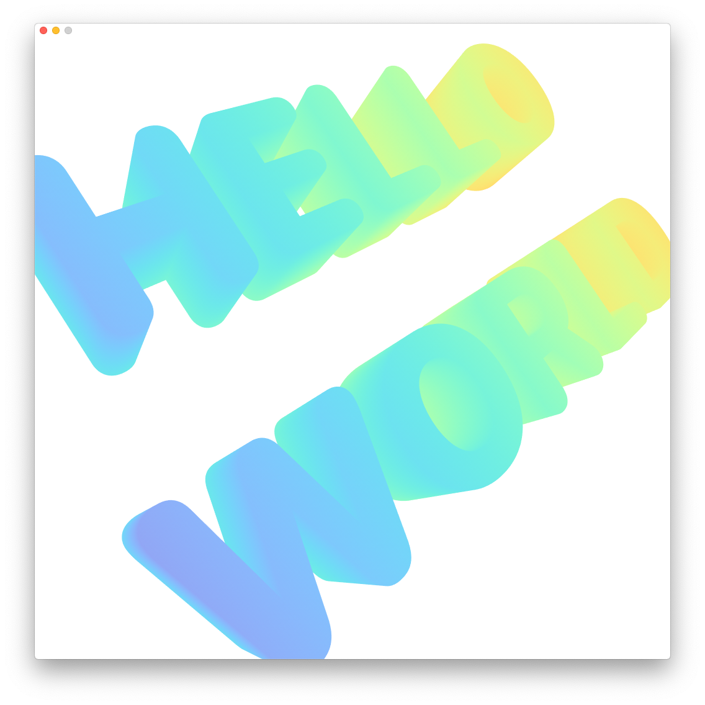
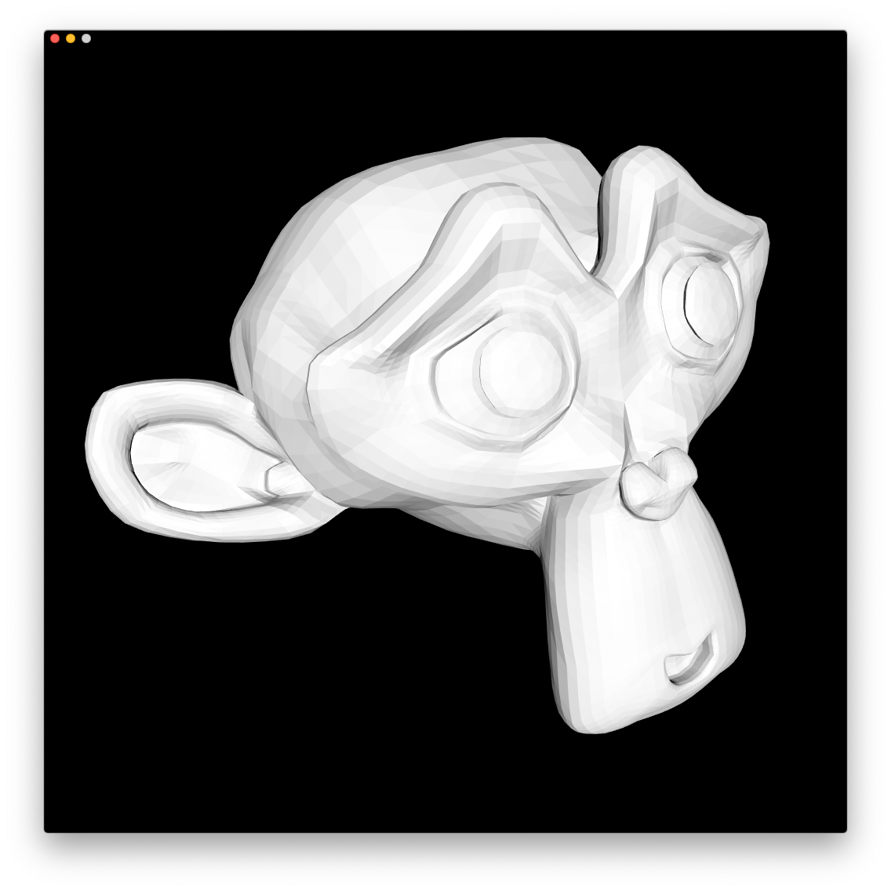
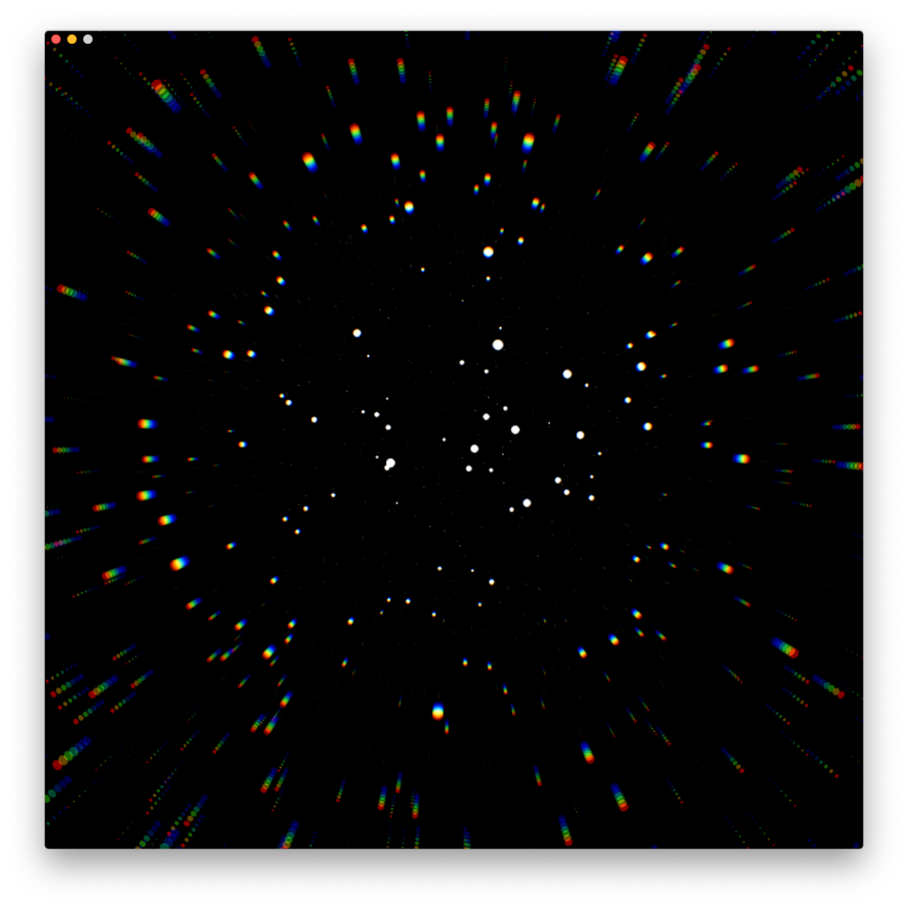
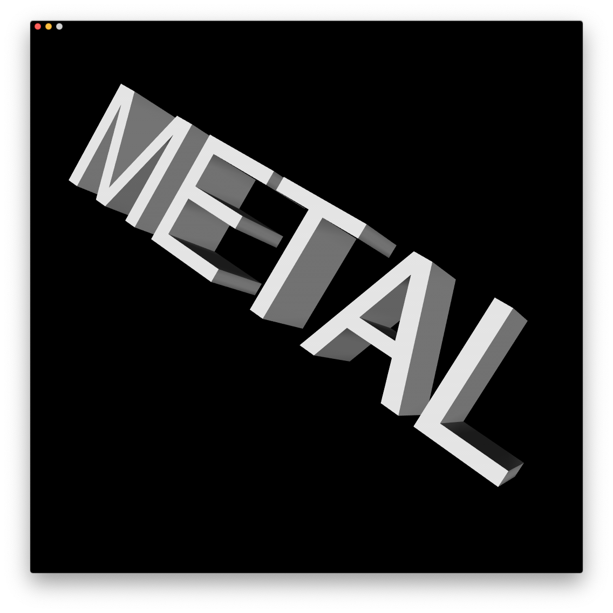

# Satin - A 3D Graphics Framework built on Apple's Metal


# About :wave:

Satin is a 3D graphics framework (inspired by threejs) that helps designers and developers work with Apple's Metal API. Satin provides helpful classes for creating meshes, materials, buffers, uniforms, geometries, pipelines (shaders), compute kernels, etc and render them on screen or to textures. 

Satin makes simple graphics tasks fun and easy to accomplish quickly and complex graphics tasks easier to accomplish without having to write tons of boilerplate code. It does this by providing structure, opinions, and tons of helpful abstractions on Metal to help you get up and rendering / coding in a few minutes. 

Satin is mostly Swift based, however when doing performing expensive CPU operations, Satin uses SatinCore, which is written in C (for tasks like geometry generation, triangulation, bounds & computational geometry calculations, and more) to make sure things are as fast as possible. 

# Examples :sparkles:



# Requirements :gear:

- macOS 10.15.
- Xcode 11.0.
- Swift 5.0.

# Supported Platforms :computer: :iphone: :tv:

- macOS 10.15.
- iOS 13.0.
- tvOS 13.0.

# Installation 

### Swift Package Manager
[Swift Package Manager](https://swift.org/package-manager/) is a tool for automating the distribution of Swift code and is integrated into the `Swift` compiler. Once you have your Swift package set up, adding `Satin` as a dependency is as easy as adding it to the `dependencies` value of your `Package.swift`.

```swift
  dependencies: [
      .package(url: "https://github.com/Hi-Rez/Satin.git", .branch("master"))
  ]
```

### CocoaPods
[CocoaPods](https://cocoapods.org) is a centralized dependency manager for Cocoa projects. For usage and installation instructions, visit their website. To integrate `Satin` into your Xcode project using CocoaPods, specify it in your `Podfile`:

```ruby
pod 'Satin'
```

# Features :clipboard:

- [x] Tons of examples that show how to use the API (2D, 3D, Raycasting, Compute, Exporting, Live Coding, AR, etc). 
- [x] Object, Mesh, InstancedMesh, Material, Shader, Geometry and Renderer classes.
- [x] You can live code shaders :fire:.
- [x] A couple builtin Materials (BasicColor, BasicTexture, BasicDiffuse, Normal, UV Color, Skybox, MatCap, and more).
- [x] Tons of Geometries (Box, Sphere, IcoSphere, Circle, Cone,  Quad, Plane, Capsule, RoundedRect, Text, and more).
- [x] Cameras (Orthographic, Perspective).
- [x] 2D & 3D Camera Controllers.
- [x] Run-time & Dynamic Struct creation via Parameters for Buffers and Uniforms.
- [x] Metal Shader Compiler (useful when live coding), used in LiveShader (which is used in LiveMaterial).
- [x] Buffer & Texture Compute Systems for crunching data fast and hard. 
- [x] A fast GPU Raycaster (very helpful to see what you clicked or tapped on).  
- [x] Hooks for custom Metal rendering Mesh's preDraw, Material's onBind, Buffer & Texture Computes' preCompute, etc
- [x] FileWatcher for checking if a resource or shader file has changed. 

# Usage :rocket:

Satin helps to draw things in a Metal backed view. To get up and running quickly without tons of boilerplate code and worrying about triple buffering or event (setup, update, resize, key, mouse, touch) callbacks, Satin pairs well with [Forge](https://github.com/Hi-Rez/Forge), but can be used without it. The example below shows how to used Forge & Satin together to render a color changing box that looks at a moving point in the scene. 

### Simple Example:

```swift
import SwiftUI
import MetalKit

import Forge
import Satin

// Subclass Forge's Renderer to get triple buffered rendering and 
// callbacks for Setup, Update, Draw, Resize and Events
class SimpleRenderer: Forge.Renderer {

    // A Context contains important information that is needed to help compile shaders 
    // and ensure we are drawing with the right color and depth pixel formats and sample count
    var context: Context!

    // A Satin Renderer handles setting the Content on all the objects in the scene graph 
    // and drawing the scene either to a texture or on screen  
    var renderer: Satin.Renderer!
    
    // A PerspectiveCamera is used to render the scene using perspective projection 
    // All Satin Cameras inherit from Object, so it has 
    var camera: PerspectiveCamera!
    
    // An Object is just an empty node in Satin's Scene Graph, it can have children and a parent
    // Objects have a position, orientation, scale and label 
    var scene: Object = Object("Scene")
        
    // Meshes inherit from Object, so they have all the properties an object has. 
    // A Mesh has unique properties like geometry, material and rendering properties
    // To create renderable object aka a Mesh, you passing it a Geometry and Material like so
    var boxMesh = Mesh(geometry: BoxGeometry(size: 1.0), material: BasicDiffuseMaterial(0.75))
    
    // Create a time variable so we can change things in our scene over time
    var time: Float = 0.0

    // Forge calls setup once after it has a valid MTKView (mtkView)
    override func setup() {
        // Forge's Renderer class provides a MTLDevice and convenience getters for the view's color pixel format, 
        // depth pixel format and stencil pixel format, by default a Forge Renderer has depth
        context = Context(device, sampleCount, colorPixelFormat, depthPixelFormat, stencilPixelFormat)
        
        // When creating a camera, you can specify an initial position and the near and far plane values
        camera = PerspectiveCamera(position: [0.0, 0.0, 5.0], near: 0.01, far: 100.0)
        
        // Create a Satin Renderer by passing in a context, scene and camera
        renderer = Satin.Renderer(context: context, scene: scene, camera: camera)
        // There are many properties you can set on the renderer, this is how to clear to white
        renderer.setClearColor([1, 1, 1, 1])
        
        //Finally add the box mesh created above to the scene
        scene.add(boxMesh)
    }
    
    // Forge calls update whenever a new frame is ready to be updated, make scene changes here
    override func update() {
        // We increment our time variable so we can procedurally set the box mesh's orientation and material color
        time += 0.05
        let sx = sin(time)
        let sy = cos(time)
        
        // Setting a material property done by using the set function, this modifies the material's uniforms
        boxMesh.material?.set("Color", [abs(sx), abs(sy), abs(sx + sy), 1.0])
        
        // You can manually an object's position, orientation, scale, and localMatrix. Here I'm using a 
        // convenience lookAt function to orient the box to face the point passed from its current position
        boxMesh.lookAt([sx, sy, 2.0])
    }

    // Forge calls draw when a new frame is ready to be encoded for drawing
    override func draw(_ view: MTKView, _ commandBuffer: MTLCommandBuffer) {
        guard let renderPassDescriptor = view.currentRenderPassDescriptor else { return }

        // To render a scene into a render pass, just call draw and pass in the render pass descriptor
        // You can also specify a render target and render to a texture instead
        renderer.draw(renderPassDescriptor: renderPassDescriptor, commandBuffer: commandBuffer)
    }
    
    // Forge calls resize whenever the view is resized
    override func resize(_ size: (width: Float, height: Float)) {
        // whenever the screen is resized we need to make sure:  
        
        // our camera's aspect ratio is set
        camera.aspect = size.width / size.height

        // our renderer's viewport & texture sizes are set 
        renderer.resize(size)
        // if you need to render to a custom viewport, you can specify that after the resize call: 
        // renderer.viewport = MTLViewport(...)
    }   
}

// Using SwiftUI you can use a ForgeView to easily create a MTKView and pass in a Forge.Renderer
struct ContentView: View {
    var body: some View {
        ForgeView(renderer: SimpleRenderer())
    }
}
```

# To Do 

- [ ] More Documentation
- [ ] Instanced Mesh
- [ ] Line Mesh
- [ ] Physically Based Shading, Lighting, Shadows
- [ ] SDF Text Rendering
- [ ] RoundedBox Geometry
- [ ] Flexible Vertex Structure
- [ ] Ray Tracing Compute System

# Contributing :tada:

- Suggest your idea as a [feature request](https://github.com/Hi-Rez/Satin/issues/new) for this project.
- Create a [bug report](https://github.com/Hi-Rez/Satin/issues/) to help us improve.
- Start a [discussion](https://github.com/Hi-Rez/Satin/discussions/new) to give use feedback on what needs to be improved or built. 
- Propose your own fixes, suggestions and open a pull request with the changes.

# Code of Conduct :speech_balloon:

Be nice. There are no stupid questions. 

# Credits :sunglasses:

Satin is owned and maintained by [Reza Ali](https://www.syedrezaali.com). You can follow me on Twitter at [@rezaali](https://twitter.com/RezaAli) or contact me via [email](mailto:reza@hi-rez.io) for project updates, releases and questions. 

# Support :raised_hands:

Satin is a labor of love and is hand crafted to be fun to use, fast and friendly. Please consider supporting the project if you use Satin in your projects. Past sponsors include: [The Frank-Ratchye STUDIO for Creative Inquiry](https://studioforcreativeinquiry.org/). 

# License :mortar_board:

Satin is released under the MIT license. See [LICENSE](https://github.com/Hi-Rez/Satin/blob/master/LICENSE) for details.
